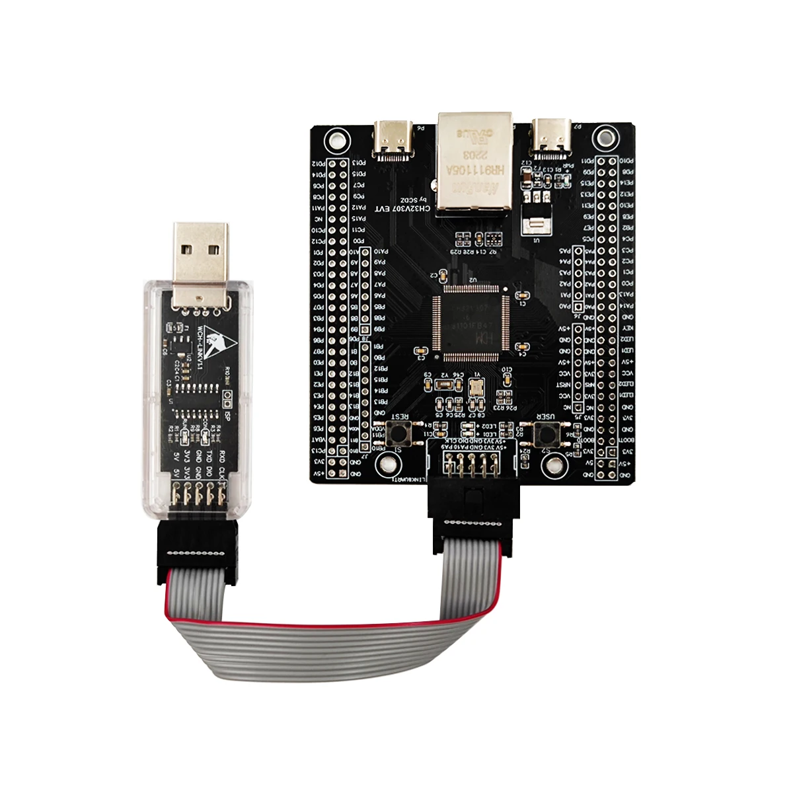
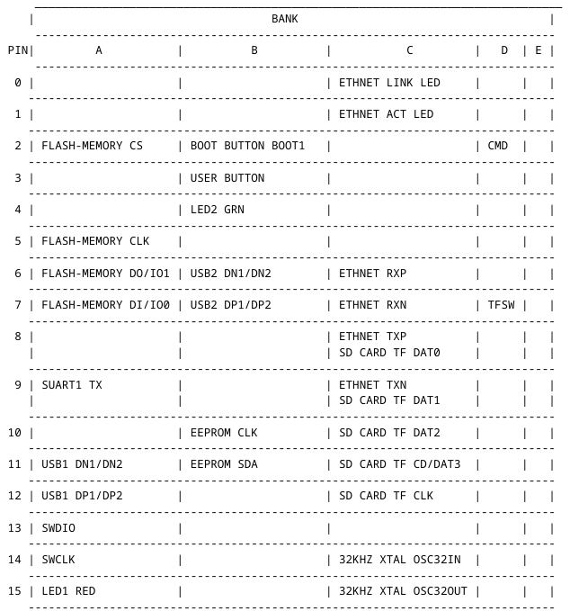

# DCS-BIOS-Control-Panel
DCS-BIOS Control Panel using a WCH CH32V307VTC compatible dev board.  Send commands via UDP over an integrated ethernet port.  Commands operate cockpit controls within Eagle Dynamic's DCS World.

This code was cobbled together by Randy S. Bancroft, a.k.a. CannonFodderSE (https://github.com/CannonFodderSE) using various examples from openwch's git hub page at https://github.com/openwch/ch32v307 with assistance from ChatGPT.

I am not a professional programmer. I went to Google and Youtube universities :)
So forgive any nonstandard programming.

It's purpose is to interface hardware (switches, knobs, etc..) from DIY cockpit panels for use with Dynamic Eagle's Digital Combat Simulator (DCS) flight simumlator (see https://www.digitalcombatsimulator.com) via DCS-BIOS (see https://github.com/DCS-Skunkworks/dcs-bios and  https://gitmemories.com/DCS-Skunkworks/dcs-bios).

Communication is UDP protocol that is transmitted via an integrated ethernet port on the MCU.  WiFi is not support.  Hardware is not capable. Theoretically you can connect up to 252 of these devices to a standard home network with only one computer connected.  With up to 60 useable gpio pins per module, that would give you 15120 buttons or 7560 encoders.

Hardware used is a CH32V307VCT6 RISC-V Development Board as seen on AliExpress at https://www.aliexpress.us/item/3256809231229507.html.  Referred to as "device" from this point on.

This is different that the CH32V307VCT6 dev boards from WCH. See example at https://www.amazon.com/MARALANG-Evaluation-CH32V307VCT6-CH32V307V-EVT-R1-500709463/dp/B0D768JL1N.

Program should work with any CH32V307VCT6 dev boards with an intergated ethernet port.  May require some pin reassignements.

I sorry if explaining the configuration below seem redudant, obvious or long winded.  Go ahead an jump into it as you see fit.  I've come across too many projects on github that don't explain how they work or how to use it, assuming the reader is well versed in the subject matter.  This is for those who want to get up and running without reverse engineering the project to make simple changes.  One configuration file is all that needs to be edited.

The program is compiled and uploaded to the device using MounRiver Studio 2.  It can be download at "https://mounriver.com/download".  The site is in Chinesse.  The uppder right corner has a place to click for English.  There are versions for Windows, Linux and Mac.  You will need a WCH-LINKE to upload the program to the board.  You can find one on AliExpress at "https://www.aliexpress.us/item/3256805438671322.html?utparam-url=scene%3Asearch%7Cquery_from%3A%7Cx_object_id%3A1005005624986074%7C_p_origin_prod%3A" or Amazon at "https://www.amazon.com/WCH-Link-Framework-Debugging-Interface-Programming/dp/B0FB47YS4Z".  Some times you can find the board and link as a combination package.  The user manaul can be found here "https://www.olimex.com/Products/RISC-V/WCH/WCH-LinkE/resources/WCH-LinkUserManual.PDF".  Image below show the WCH-LINKE, smaller device to the left.

A configuration file (dcs_config.ini.inc) is used to define the network settings, encoder and button pin assignments and their associated message to send to DCS-BIOS.  Encoders send a message on each click. Message is different for clockwise and counter-clockwise.  Buttons send a message when pressed and a different message when released.  The file is in ".ini" format.  It is compiled into the program.  So you will have to recompile and upload the firmware everytime you make a change.

When editing the configuration file, each line must be enclosed in quotes and end with "\r\n" or else it will not be interpreted.  It could even corrupt the program.  See example for setting the debounce time for buttons and encoders below.  This sets the debounce time to 10 milliseconds.

	"debounce_ms = 10\r\n"

First line of the file is it's title "DCS Config" followed by a "general" section containing two parameters, "debounce_ms" and "max_text_length".  See code below.  Note the semicolon ";" at the beginning of the title.  Semicolons are comment or remarks in ".ini" format.  These are ignored.  They will use memory space because the configuration file is compiled into the program.  To many comments and you may run out of memory.

"debounce_ms" is used to ignore multiple switch or encoder signal within in a very short period of time.  When the electrical contacts are connected they tend to be what we call noisey.  They generate multiple electrical spikes that can be interpreted as multiple switch closings and openings.  Debounce makes the program wait a short period for the noisey signal to stabilize before another change of state is consider valid.  If we didn't do this it would send multiple copies of the signal in rapid order.  Say we press the flare button.  Without debounce it could launch all of your flares at once rather that the intended single fire.  Leaving you with no flares to ward off incoming missiles.

"max_text_length" set the maximum length of the commands being sent.  Using a program called "bort" to see as many possible commands that can be sent, I did not find any longer that 48.  This keep packet size to a minimum.  The entire command will fit within one packet.  I chose to make it an adjustable parameter in case a futre command exceeds this length.  Rather than rewite the code to adjust for it, we can change it here.

Bort (Bios Reference Tool) can be used to find any command you need to control DCS.  You can even send signals for test.  It can be downloaded at "https://github.com/DCS-Skunkworks/Bort".

	"; DCS Config\r\n"
	"[general]\r\n"
	"debounce_ms = 10\r\n"
	"max_text_length = 48\r\n"
	
Network setting are used to configure how the device connects to your network.  Below is a sample network configuration.  "dhcp" is not implemented.  Could not get it to work.  Combining it with the UDP functions used too much memory and would error out saying so.  Maybe in the future.  If you figure out how to do it, please let me know.

"use_dcs_ip", when set to 1, will have the device send the commands directly to the IP address of the computer running DCS with DCS-Bios.  The addres is set in "dcs_ip".  If "use_dcs_ip" is set to 0 (zero), commands are sent to the broadcast address of your network.

The chip has a default mac address internally.  However, if you desire to change it you can set it in the "mac" line.  Values are in standard format of two digit hexadecimal separated by colons.  Anything else will not work.  If set to all zeros, as in the example below, it will use the chip's mac.

"module_ip" is the device's IP address you assign for your network.  Make sure there is no other device with the same address.  If you make multiple devices, ensure they use different mac and IP addresses.

"subnet_mask" and "gateway" are usually assigned to your network by your internet router.

For Windows user you can open a command prompt by the Windows key and "R" together and typing "cmd" in the box that opens.  This will open a command prompt window.  Enter "ipconfig" and hit enter.  You will see your computer's IP address (IPv4 Address), subnet mask and default gateway.  Use the subnet and gateway addresses that contains three periods/dots ".", not the one with colons ":".  Just like they are in the example below.

To get your IP information on a Mac, go to the Apple menu, select System Settings, then click on Network. Choose your network connection, and your IP address will be displayed in the details section.

Linux user most likely already know, you can open a terminal and enter "ip addr".  You will see "inet' followed by your IP address, a slash "/" and another numner.  Most likely 24.  If it is 24 your net mask is "255.255.255.0".  If it is some other number you can use this web site, "https://sagecalculator.com/network-mask-calculator/".  Enter your IP address.  Place the number after the shash in the "CIDR Notation" block.  Click "Calculate".  Your subnet mask will be shown below it.

Use your IP address, but change the last number after the dots.  Do not use "0" or "255".  These are reserved addresses with special purposes. Do not use a number larger that 255.  Check to ensure the address you chose is not already in use by opening a terminal or command prompt. Enter "ping " and the IP address you chose.  Try a different adress if you get get a response like this.  It is already in use:

	"64 bytes from 192.168.0.1: icmp_seq=1 ttl=64 time=0.193 ms"

Last setting in networking is "port".  This is the port DCS-BIOS listens on for commands.  Nornally "7778", unless you changed it in it's lua script.

	"[network]\r\n"
	"dhcp = 0; not implemented\r\n"
	"use_dcs_ip = 0; Use DCS computer IP\r\n"
	"dcs_ip = 192.168.0.202; IP address for computer running DCS\r\n"
	"; Custom mac address\r\n"
	"; Set 00:00:00:00:00:00 to use chip mac address\r\n"
	"mac = 00:00:00:00:00:00\r\n"
	"module_ip = 192.168.0.50; IP address for CH32V307 module\r\n"
	"subnet_mask = 255.255.255.0; netmask for your network\r\n"
	"gateway = 192.168.0.1; gateway for your network\r\n"
	"dcs_port = 7778; default DCS-BIOS port to receive control inputs\r\n"

DCS-BIOS says it sends data via UDP to multicast address 239.255.50.10 and listens on your local address (127.0.0.1) and your computer's IP address.  In testing, I discover DCS-BIOS will also respond to commands sent to the broadcast address of a network.  Using this tidbit of information I coded this to automatically caculate the braodcast address from the IP address and netmask.  It will send all commands to this address unless "use_dcs_ip" is set to 1.  This means the computer running DCS/DCS-BIOS must be on the same local network as your device.  The UDP packet will not go past your router.

Encoders are EC11 or compatable. Each has four parameters per encoder plus a count field that defines the total number of encoders used.  Each encoder is defined as "enc" plus the encoder number plus the parameter. Pin parameters are "_a_pin" and "_b_pin" respectively for pins "a" and "b" assignments and "_cw_text" and "_ccw_text" for message depending  on direction of rotation.  If the messages are reversed when rotating the encoder, you can physically swap the pins, swap the pin definitions or swap the messages.  For encoders with a push button feature when you press the knob in, the push button is configured in the button definitions as a normal momentary contact switch.

Example code below defines one encoder, encoder 0. It assigns encoder input "a" to pin "PB0" and input "b" to pin "PB1".  The common pin is tied to grounds.  When rotated clockwise, to the right for the millennials and newer :), it will send the message "NS430_RIGHT_SMALL_BTN_ROT -3200" and counter clockwise will send "NS430_RIGHT_SMALL_BTN_ROT +3200".

	[encoders]\r\n"
	"count = 1\r\n"
	"enc0_a_pin = PB0\r\n"
	"enc0_b_pin = PB1\r\n"
	"enc0_cw_text = NS430_RIGHT_SMALL_BTN_ROT -3200\r\n"
	"enc0_ccw_text = NS430_RIGHT_SMALL_BTN_ROT +3200\r\n"

In DCS, if equiped with NS430 navigation system, you will see the small dial on the right rotate in response to the messages.  3200 equals one click in DCS-BIOS.  +/- indicates direction.

Buttons are configured in a similar fasion, but have only three parameters each  plus a count to define the number of buttons total.  Buttons are momentary contact, but can be toggle switches.  A message is sent when it is press or turned on and a separate message when released or turned off.

Example code below defines one button, button 0. It assigns button input to pin "PE0".  When pressed/closed it will send the message "LDG_LIGHT_SW INC" and "LDG_LIGHT_SW DEC" when released/opened.

	"[buttons]\r\n"
	"count = 1\r\n"
	"btn0_pin = PE0\r\n"
	"btn0_press_text = LDG_LIGHT_SW INC\r\n"
	"btn0_release_text = LDG_LIGHT_SW DEC\r\n"

DCS-BIOS also has togle commands.  For example "LDG_LIGHT_SW TOGGLE".  When using these commands, set only one parameter for momentary contact switches.  Leave the other blank/empty.  If you set both to toggle, it will enable the feature when closing the switch and immediately disable it when releaseing the switch. With toggle switches you will set both messages to toggle.  It will flip the state when you close the switch and flip it back when you open it.  If the the state of the switch, in the game, when you first load up does not match the physical position of you toggle switch you will have to switch it in game once to match your physical position.  See examples below:

For momentary contact switches:

	"btn0_press_text = LDG_LIGHT_SW TOGGLE\r\n"
	"btn0_release_text = \r\n"

For toggle switches:

	"btn0_press_text = LDG_LIGHT_SW TOGGLE\r\n"
	"btn0_release_text = LDG_LIGHT_SW TOGGLE\r\n"

GPIO pin notes:

	-Ethernet uses GPIO pins PC0 (LINK LED), PC1 (ACT LED), PC6 (RXP), PC7 (RXN), PC8 (TXP) and PC9 (TXN).  Solder bridges have to be closed on the bottom of the board for these to function.
	
	-These are configured by the ehternet driver
	
	-Printf statements send serial text via GPIO pin PA9 (SUART1 TX)
		
	-WCH-LINKE programmer/debugger uses GPIO pins PA13 (SWDIO) and PA14 (SWCLK)
	
	-LEDs use GPIO pins PA15 (LED1 red) and PB4 (LED2 green)
	
	-Power LED does not use ay GPIO pins
	
	-If associated solder bridges are shorted, microSD TF card reader used GPIO pins PC8 (DAT0), PC9 (DAT1), PC10 (DAT2), PC11 (CD/DAT3), PC12 (CLK), PD2 (CMD) and PD7 (TFSW).  PC8 and PC9 are shared with ethernet port.
	
	-FT24C32A-ETR-T (33kbit EEPROM) memory uses GPIO pins PB10 (SCL) and PB11 (SDA)
	
	-Flash memory (W25Qxxx) uses GPIO pins PA2 (CS), PA5 (CLK), PA6 (DO/IO1) and PA7 (DI/IO0)
		
	-USB port 1 uses GPIO pins PA11 (DN1/DN2) and PA12 (DP1/DP2)
		
	-USB port 2 uses GPIO pins PB6 (DN1/DN2) and PB7 (DP1/DP2)
	
	-32.768kHz crystal uses GPIO pins PC14 (OSC32IN) and 
	
	-PC15 (OSC32OUT)
	
	-User button uses GPIO pin PB3
	
	-GPIO pin PB2 (BOOT1) is held low with an external 10k resistor. It has a open solder bridge that can be shorted to pull the port high.

See table below for easier visualization.  Blank square are free for use GPIO pins.

 Reserved pins that cannot be configured are listed in gpio_mgr.c.
